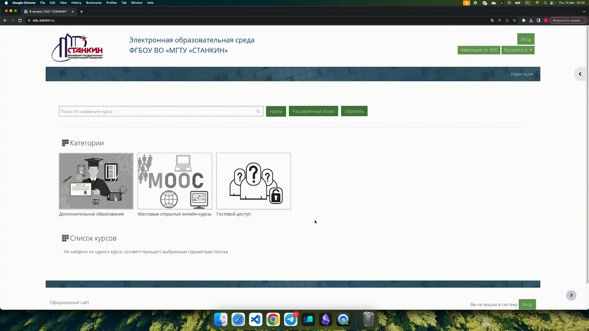
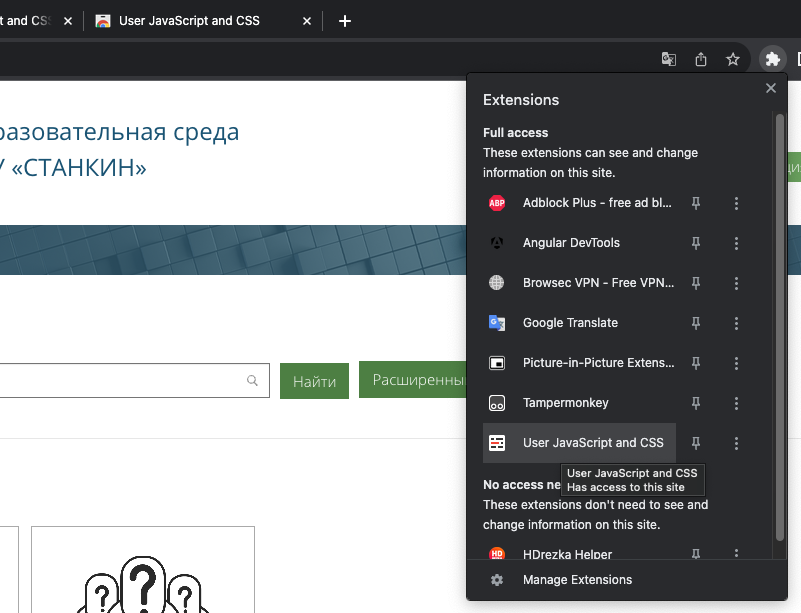
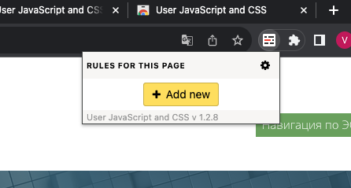
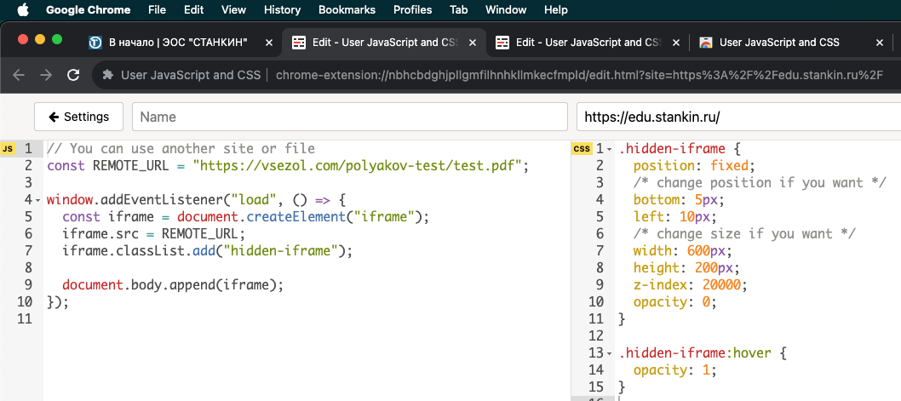

# Stankin Test Helper

## Как использовать?

Наводите курсор в левый нижний угол - у вас появляется окно с файлом. Поиск по странице тоже работает. Помогает 100% - проверено опытом, все отлично работает :)


## Как настроить?

1. Устанавливаете расширение [User JavaScript and CSS](https://chromewebstore.google.com/detail/user-javascript-and-css/nbhcbdghjpllgmfilhnhkllmkecfmpld)

2. Заходите на https://edu.stankin.ru

3. Выбираете расширение из списка
   

4. Нажимаете добавить (Аdd new)
   

5. Вставляете код (ищите его чуть ниже)
   

6. Жмете сохранить (Ctrl + S) или кнопку

7. **Вы закончили настройку! Переходите обратно на сайт!**

### Режим с поиском ответов - Код

JS код (левое окно)

```js
// SETTINGS

const MIN_LENGTH = 3;
const MAX_LENGTH = 800;
const DEBOUNCE_TIME = 300;
const ANSWERS_LIST_URL = "https://techleadbrother.github.io/test/test.json";

// MAIN CODE

let answersList = [];

const loadAnswersList = () => {
  fetch(ANSWERS_LIST_URL)
    .then((data) => data.json())
    .then((response) => {
      answersList = response;
    });
};

const handleSelection = debounce(() => {
  const selectedText = document
    .getSelection()
    ?.toString()
    ?.trim()
    ?.toLowerCase();

  if (!isValidText(selectedText)) {
    return;
  }

  for (let item of answersList) {
    const hasAnswer = item?.question?.toLowerCase()?.includes(selectedText);

    if (hasAnswer) {
      changeHint(item.answer);
      break;
    }
  }
}, DEBOUNCE_TIME);

window.addEventListener("load", () => {
  createHintElement();
  loadAnswersList();
});

document.addEventListener("selectionchange", handleSelection);

// HELPERS
function changeHint(answer) {
  const hint = document.querySelector(".stankin-test-hint");
  const text = Array.isArray(answer) ? answer.join(", \n") : answer;
  hint.innerHTML = text;
}

function createHintElement() {
  const hint = document.createElement("div");
  hint.classList.add("stankin-test-hint");
  document.body.append(hint);
}

function isValidText(text) {
  return (
    typeof text === "string" &&
    text.length >= MIN_LENGTH &&
    text.length <= MAX_LENGTH
  );
}

function debounce(callback, timeout) {
  let timerId;

  return (...args) => {
    clearTimeout(timerId);

    timerId = setTimeout(() => callback(...args), timeout);
  };
}
```

CSS код (правое окно)

```css
.stankin-test-hint {
  position: fixed;
  bottom: 5px;
  left: 20px;
  z-index: 20000;

  color: grey;
  font-size: 10px;
  width: 200px;

  opacity: 0;

  background-color: white;
  white-space: pre-wrap;
}

.stankin-test-hint:hover {
  opacity: 1;
}
```

### Режим с встроенным файлом - Код

JS код (левое окно)

```js
// Вы можете использовать другую ссылку на файл или сайт
const REMOTE_URL = "/url/to/your/file";

window.addEventListener("load", () => {
  const iframe = document.createElement("iframe");
  iframe.src = REMOTE_URL;
  iframe.classList.add("hidden-iframe");

  document.body.append(iframe);
});
```

CSS код (правое окно)

```css
.hidden-iframe {
  position: fixed;
  /* Вы можете изменить положение окна */
  bottom: 5px;
  left: 10px;
  /* Вы можете изменить размер окна */
  width: 600px;
  height: 200px;
  z-index: 20000;
  opacity: 0;
}

.hidden-iframe:hover {
  opacity: 1;
}
```
